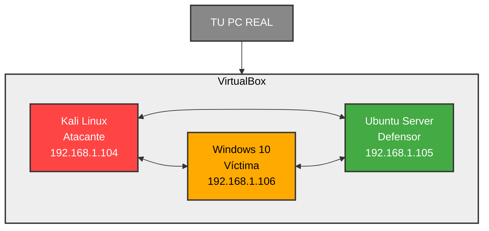

# Arquitectura del Laboratorio

## Diagrama de Red


## Configuración de Red

### Modo Puente (Bridged Adapter)
- **Ventaja**: Las máquinas obtienen IPs reales de tu router
- **IP asignadas**:
  - Kali: `192.168.1.104`
  - Ubuntu: `192.168.1.105`
  - Windows: `192.168.1.106`

### Verificación de Conectividad
```bash
# Desde Kali
ping 192.168.1.106  # Windows
ping 192.168.1.105  # Ubuntu

# Desde Windows (CMD)
ping 192.168.1.104  # Kali
ping 192.168.1.105  # Ubuntu
Recursos Asignados por Máquina
Máquina	RAM	CPUs	Disco	Sistema Operativo
Kali	2048 MB	2	25 GB	Kali Linux 2025.4
Windows	4096 MB	2	50 GB	Windows 10 Pro
Ubuntu	2048 MB	2	25 GB	Ubuntu Server 22.04
text

---

